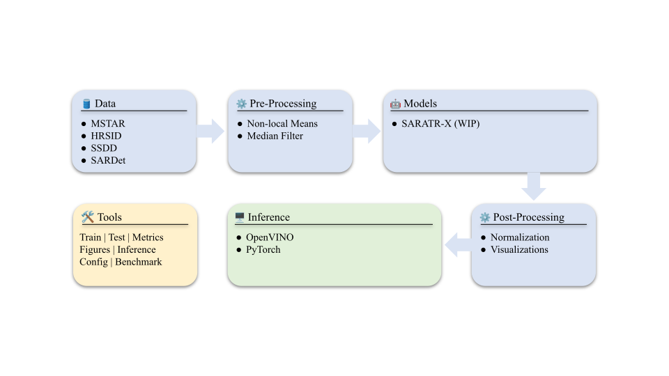

# Benchmarking suite for synthetic aperture radar imagery anomaly detection (SARIAD) algorithms

<figure>
  
  <figcaption>
      Figure 1: Overall figure describing the flow of SARIAD. The figure is adapted from <a href="https://arxiv.org/abs/2202.08341">Anomalib</a> for comparison. The component lists in the figure date from the paper; see the lists below for what is available now.
  </figcaption>
</figure>

## Overview
SARIAD integrates SAR datasets, anomaly detection models and pre-processing methods with [Anomalib](https://anomalib.readthedocs.io/) (PyTorch Lightning) and evaluates them with a common set of image- and pixel-level metrics. Every [Anomalib model](https://anomalib.readthedocs.io/) (Padim, Patchcore, EfficientAd, Dinomaly, ...) can be used by name next to the SAR-specific ones.

| | Available |
|---|---|
| **Datasets** | MSTAR, HRSID, SSDD, SAMPLE_PUBLIC, SARDet_100K (target = anomaly; normal images are generated where the dataset has none) |
| **Models** | SARATRX (SARATR-X masked autoencoder), YOLOAnomaly (Ultralytics backbones), PadimACE (PaDiM with adaptive cosine estimator), MSFA (filter-augmented input), plus all Anomalib models |
| **Pre-processing** | NLM (non-local means), MedianFilter, SARCNN (learned despeckling), Default |
| **Metrics** | Accuracy, precision, recall, F1, G-mean, MAR/FAR, image and pixel AUROC, pixel IoU/F1, ROC/PR curves, LaTeX comparison tables |

Details, how normal data is generated and candidate datasets/models: see the [documentation](docs/index.md) (`docs/`).

## Directory structure
```
SARIAD/
├── config/          # YAML experiment runner (run.py) and default.yaml
├── datasets/        # datamodules (Anomalib Folder subclasses): mstar, hrsid, ssdd, sample_public, sardet
├── models/          # SARATRX, YOLO, PadimACE, MFSA (MSFA), components (shared Gaussian base); lazy imports
├── pre_processing/  # NLM, MedianFilter, SARCNN, Default
└── utils/           # blob_utils (download/extract), normal_gen (normal-image generation), inf (Inferencer, Metrics)
demo/                # demo.py (run a YAML file), train.py (one model on one dataset)
docs/                # Sphinx documentation
tests/               # pytest suite (offline, CPU)
```

## Installation
Python >= 3.13. From PyPI: `pip install SARIAD`.

### Development installation
```bash
git clone --recurse-submodules https://github.com/Advanced-Vision-and-Learning-Lab/SARIAD
cd SARIAD
pip install -e ".[dev]"      # or: conda env create -f SARIAD/config/environment.yaml
```
SARATRX and SARCNN need git submodules (`--recurse-submodules`, or `git submodule update --init`); nothing else does, and importing SARIAD works without them. Install a CUDA build of PyTorch first if you have a GPU (see the comment in `SARIAD/config/environment.yaml`).

## Usage
Describe the datasets, models, pre-processors and repetitions in a YAML file (see `SARIAD/config/default.yaml`) and run it:
```bash
sariad --config SARIAD/config/default.yaml --dry-run   # validate names and parameters, no downloads
sariad --config SARIAD/config/default.yaml             # runs every experiment, writes metrics, plots and comparison_table.tex
```
Datasets are stored in `./datasets` (override with `SARIAD_DATASETS_PATH` or a dataset's `path` argument).

Or from Python:
```python
from anomalib.engine import Engine
from SARIAD.datasets import SSDD
from SARIAD.models import YOLOAnomaly
from SARIAD.utils.inf import Inferencer

datamodule = SSDD()
model = YOLOAnomaly(weights="yolo11n.pt")
engine = Engine()
engine.fit(model=model, datamodule=datamodule)
print(Inferencer().evaluate(model, datamodule, engine=engine))
```
One-off runs: `python demo/train.py --dataset MSTAR --model Padim --preprocessor MedianFilter`.

## Tests
```bash
pytest                                            # offline, CPU, a few minutes
SARIAD_TEST_NETWORK=1 pytest tests/test_models_optional.py   # also downloads YOLO weights
```

## License
MIT License

## Acknowledgments
This project is inspired by [Anomalib](https://anomalib.readthedocs.io/) and [Benchmarks for Medical Anomaly Detection (BMAD)](https://github.com/dorisbao/bmad).

## Contributing
Contributions are welcome! To contribute:
1. Fork the repository on GitHub.
2. Create a new branch with a descriptive name.
3. Make your changes and ensure they follow the code style guidelines.
4. Write unit tests for any new features or bug fixes (`tests/`).
5. Submit a pull request with a clear description of your changes.

For major changes, please open an issue first to discuss what you'd like to change. We appreciate your contributions to improve this work!

## Citing SARIAD

If you use the SARIAD code, please cite the following reference using the following entry.

**Plain Text:**

L. Chauvin, S. Gupta, A. Ibarra and J. Peeples, "Benchmarking suite for synthetic aperture radar imagery anomaly detection (SARIAD) algorithms," in Algorithms for Synthetic Aperture Radar Imagery XXXII, vol. TBD. International Society for Optics and Photonics (SPIE), 2025, [DOI: 10.1117/12.3052519](https://doi.org/10.1117/12.3052519)

[](https://doi.org/10.48550/arXiv.2504.08115)

**BibTex:**

```
@inproceedings{Chauvin2025Benchmarking,
  title={Benchmarking suite for synthetic aperture radar imagery anomaly detection (SARIAD) algorithms},
  author={Chauvin, Lucian and Gupta, Somil, and Ibarra, Angelina, and Peeples, Joshua},
  booktitle={Algorithms for Synthetic Aperture Radar Imagery XXXII},
  pages={TBD},
  year={2025},
  organization={International Society for Optics and Photonics (SPIE)}
  doi={10.1117/12.3052519}
}
```

## Citing MSTAR
If you use this dataset in your research, please cite the following paper:
```
@misc{mstar2025,
  title = {MSTAR Public Dataset},
  author = {{U.S. Air Force}},
  year = {1995},
  note = {Sensor Data Management System (SDMS)},
  url = {https://www.sdms.afrl.af.mil/index.php?collection=mstar}
}
```
